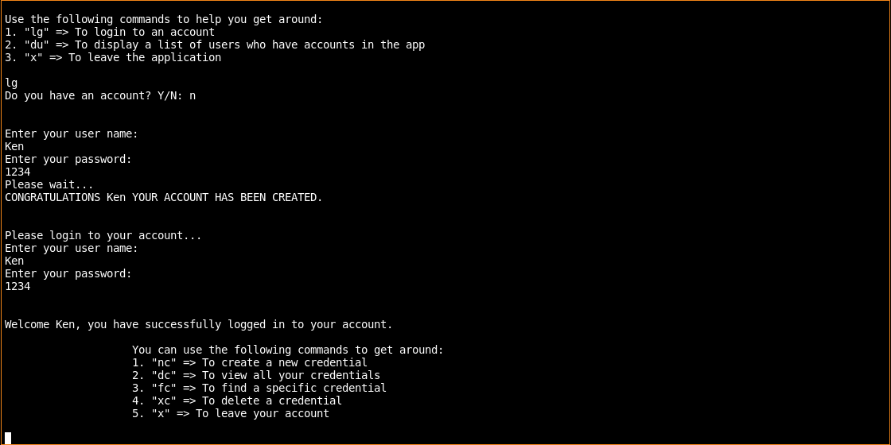

# TRUST PASSWORD PROTECTOR

This is an application that helps its user to keep the credentials for their various accounts and takes away the tedious quest of trying to remember an account username or password. The application runs on the terminal.

## Contributors
1. Ken Mbira

## Technologies Used
1. Python3
2. Pyenv virtual environments

## Dependencies
For the application to run, the following requirements have to be met:
1. One must have at least python3 installed on their device.
2. Install termcolor
3. Install pyfiglet
4. Install rich

## Set up Instructions
To have the following application in your application follow the following steps:
1. Clone this repository onto the desired location on your local machine using "git clone https://github.com/Ken-mbira/Trust_Password_Protector.git" in your terminal.
2. Navigate to the location of the application on your terminal
3. Run "chmod +x run.py"
4. Run "./run.py"

## Application Description
The application makes use of two classes, the user class and the credentials class. Inside the user class lies a method to instantiate an object or rather instance of the user class. The object contains the user name and the password. The user is then saved. This information will be used when logging in to the user's account

Next is the credentials class where the same happens in terms of instance of the credential where all the data about the credential is taken in such as: 
- The name of the account
- The username used in the account
- The email used to login to the account
- The password of the account

This data is passed onto an array and is saved there. The user can add as many credentials as needed and when they need to see them they can choose to view all their credentials at once or search for a specific credential and view only its own data.

## Known Bugs
I have not yet figured out how to have multiple users on the same application and when one tries, the data is shared for the credentials. If you feel that you know how to achieve the above, please feel free to contact me to make me aware.

## Future Improvements
In the future I intend to make the app have a single permanent storage for its data and that it does not loose all data once a user logs out of the application.

## Contact Information
In case of any queries or suggestions, you can reach me through the following handles:
1. Phone: 0758926990
2. Git-hub: Ken_mbira
3. Twitter: Ken Mbira
4. LinkedIn: Ken Mbira
5. email: mbiraken17@gmail.com

## Licence Information
MIT License

Copyright (c) [2021] [Ken-Mbira]

Permission is hereby granted, free of charge, to any person obtaining a copy
of this software and associated documentation files (the "Software"), to deal
in the Software without restriction, including without limitation the rights
to use, copy, modify, merge, publish, distribute, sublicense, and/or sell
copies of the Software, and to permit persons to whom the Software is
furnished to do so, subject to the following conditions:

The above copyright notice and this permission notice shall be included in all
copies or substantial portions of the Software.

THE SOFTWARE IS PROVIDED "AS IS", WITHOUT WARRANTY OF ANY KIND, EXPRESS OR
IMPLIED, INCLUDING BUT NOT LIMITED TO THE WARRANTIES OF MERCHANTABILITY,
FITNESS FOR A PARTICULAR PURPOSE AND NONINFRINGEMENT. IN NO EVENT SHALL THE
AUTHORS OR COPYRIGHT HOLDERS BE LIABLE FOR ANY CLAIM, DAMAGES OR OTHER
LIABILITY, WHETHER IN AN ACTION OF CONTRACT, TORT OR OTHERWISE, ARISING FROM,
OUT OF OR IN CONNECTION WITH THE SOFTWARE OR THE USE OR OTHER DEALINGS IN THE
SOFTWARE.